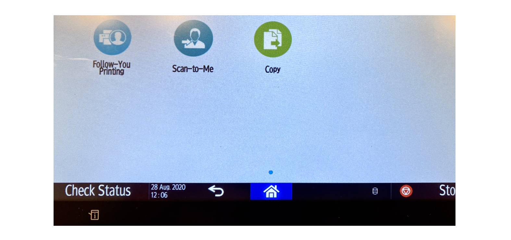

# Consistency and standards

Consistency and standards means that words, situations, actions and affordances should mean the same thing across different elements within your app, and across multiple platforms. 

# Examples

### Apple's Duplicate Menu Option

E.g. All the world used to know what *Save* and *Save As ..* meant. Then Apple introduced the *Duplicate* + *Rename*  idea as a replacement for *Save As...* people hated it. Besides being inconsistent with the rest of the UI world, the pattern also is a failure of another heuristic: [7_flexibility_and_efficiency](7_flexibility_and_efficiency.md). 

# Counterexamples
## Inconsistent Terminology

Mircea: The three options on the screen of some of the printers at ITU (as of 2023, and since 2020 at least) have frustrating labels. Follow-**You**, Scan-to-**Me** ... Who is You? Who is Me? Are they the same person? Probably. Then why not unify the options. The fact that Copy does not have a pronoun seems also quite inconsistent. 

### Two Different Buttons -- One Single Action (vibeke)

The add date read pop-up box on the goodreads.com website has two options of stopping the action happening, there is no indication of the difference between close and cancel. This creates a illusion that there is a difference between the two options, when in fact they result in the same action. 
