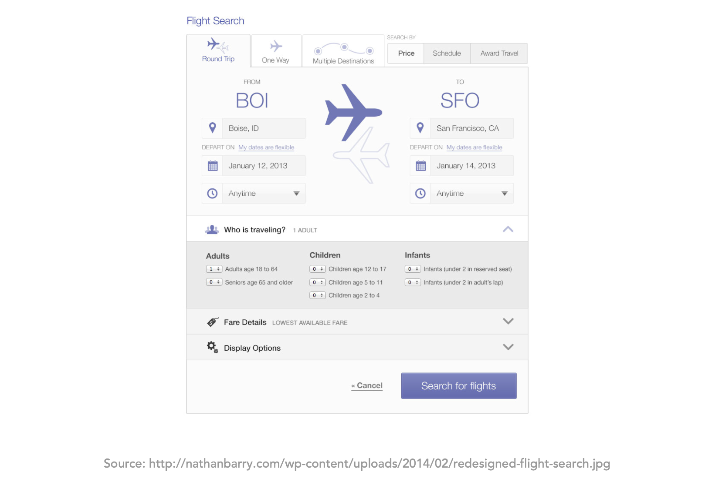

# Recognition rather than recall

Minimize the user’s memory load by making objects, actions, and options visible. The user should not have to remember information from one part of the dialogue to another. Instructions for use of the system should be visible or easily retrievable whenever appropriate.

A good example are airline websites which need to keep all the information that the user has selected in a previous step visible, such that the user is confident that they are making the right booking 

# Counter-Examples 
## Bad Icons Prevent Recognition (Emma)
After very light use, the buttons on my toaster disappeared (they should have made sure the icons were more permanent). For the last couple of years, I have just pressed a random button. I just realized, that the only button that actually means "toast this bread" is the last one. The one that is still visible, because I have never used it. I have been defrosting bread for years - apparently.

 
